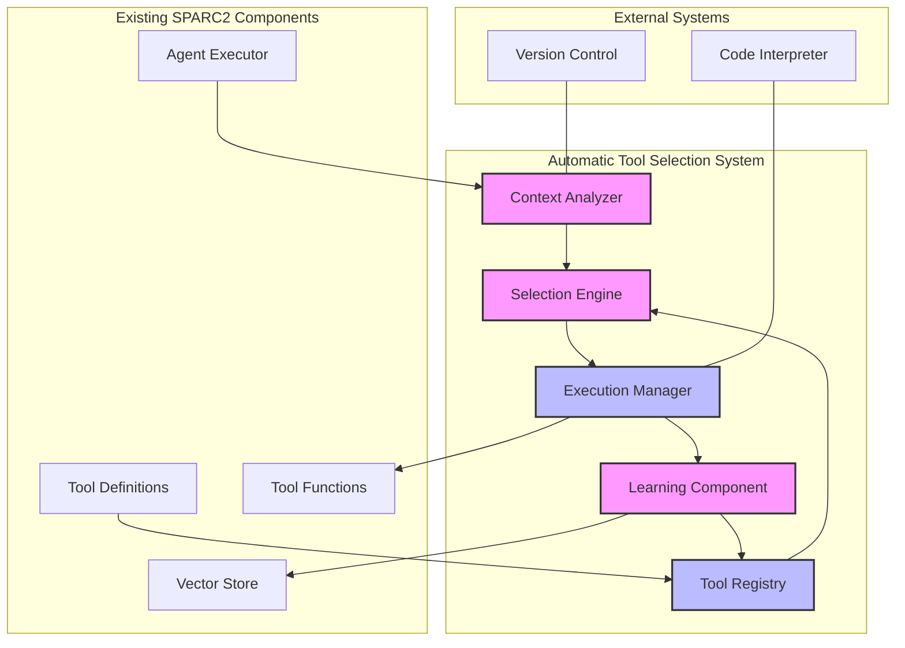
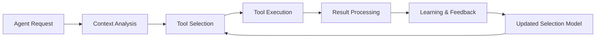
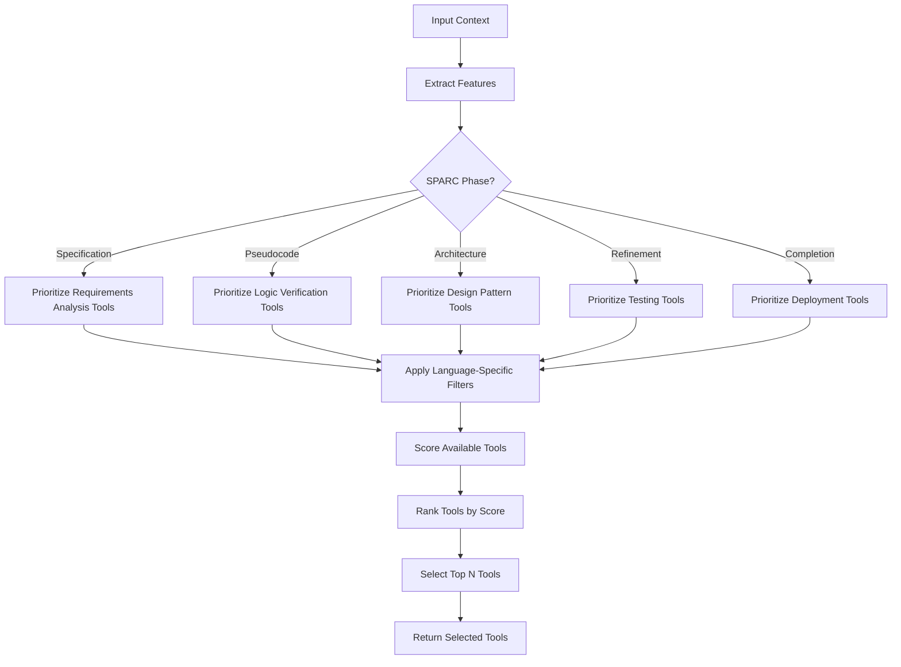

# Automatic Tool Selection in SPARC2: Architecture Design

## Table of Contents

- [System Overview](#system-overview)
- [Component Diagram](#component-diagram)
- [Data Flow Diagrams](#data-flow-diagrams)
- [Component Interfaces and APIs](#component-interfaces-and-apis)
- [Tool Selection Algorithm Design](#tool-selection-algorithm-design)
- [Integration Points with Existing SPARC2 Systems](#integration-points-with-existing-sparc2-systems)
- [Security Considerations](#security-considerations)
- [Performance Considerations](#performance-considerations)
- [Scalability Design](#scalability-design)
- [Implementation Roadmap](#implementation-roadmap)

## System Overview

The Automatic Tool Selection system enhances SPARC2 by dynamically selecting and applying the most appropriate tools for specific coding tasks based on context, code state, and the current phase in the SPARC methodology. This capability improves the testing feedback loop for long-running agentic processes, reducing latency and increasing the quality of generated code.

The system consists of several key components:
1. **Context Analyzer**: Analyzes the current code context, task description, and SPARC phase
2. **Tool Registry**: Maintains metadata about available tools and their capabilities
3. **Selection Engine**: Implements algorithms to score and rank tools based on relevance
4. **Execution Manager**: Handles tool execution and result processing
5. **Learning Component**: Improves tool selection over time based on success metrics

## Component Diagram



## Data Flow Diagrams

### High-Level Data Flow



### Tool Selection Process



## Component Interfaces and APIs

### Context Analyzer

```typescript
interface ContextAnalyzer {
  /**
   * Analyze the current context and extract relevant features
   * @param context The current agent context
   * @returns Features extracted from the context
   */
  analyzeContext(context: AgentContext): Promise<ContextFeatures>;
  
  /**
   * Determine the current SPARC phase based on context
   * @param context The current agent context
   * @returns The identified SPARC phase
   */
  determineSPARCPhase(context: AgentContext): Promise<SPARCPhase>;
  
  /**
   * Identify programming languages in the current context
   * @param context The current agent context
   * @returns Array of identified languages
   */
  identifyLanguages(context: AgentContext): Promise<string[]>;
}

interface ContextFeatures {
  sparcPhase: SPARCPhase;
  languages: string[];
  complexity: number;
  taskType: TaskType;
  codeStructure: CodeStructure;
  testingStatus: TestingStatus;
}

enum SPARCPhase {
  SPECIFICATION,
  PSEUDOCODE,
  ARCHITECTURE,
  REFINEMENT,
  COMPLETION
}
```

### Tool Registry

```typescript
interface ToolRegistry {
  /**
   * Register a tool with metadata
   * @param toolName The name of the tool
   * @param metadata Metadata about the tool
   */
  registerTool(toolName: string, metadata: ToolMetadata): void;
  
  /**
   * Get metadata for a specific tool
   * @param toolName The name of the tool
   * @returns Metadata for the tool
   */
  getToolMetadata(toolName: string): ToolMetadata;
  
  /**
   * Get all registered tools
   * @returns Record of all tools and their metadata
   */
  getAllTools(): Record<string, ToolMetadata>;
  
  /**
   * Get tools suitable for a specific SPARC phase
   * @param phase The SPARC phase
   * @returns Array of tool names
   */
  getToolsForPhase(phase: SPARCPhase): string[];
  
  /**
   * Get tools suitable for a specific language
   * @param language The programming language
   * @returns Array of tool names
   */
  getToolsForLanguage(language: string): string[];
}

interface ToolMetadata {
  name: string;
  description: string;
  capabilities: string[];
  suitablePhases: SPARCPhase[];
  supportedLanguages: string[];
  prerequisites: string[];
  successMetrics: string[];
  usageHistory: ToolUsageHistory[];
}

interface ToolUsageHistory {
  timestamp: number;
  context: ContextFeatures;
  success: boolean;
  executionTime: number;
  feedback?: string;
}
```

### Selection Engine

```typescript
interface SelectionEngine {
  /**
   * Select the most appropriate tools for the current context
   * @param context The current agent context
   * @param features Features extracted from the context
   * @param maxTools Maximum number of tools to select
   * @returns Array of selected tool names
   */
  selectTools(
    context: AgentContext, 
    features: ContextFeatures, 
    maxTools?: number
  ): Promise<string[]>;
  
  /**
   * Score a tool based on relevance to the current context
   * @param toolName The name of the tool
   * @param metadata Metadata about the tool
   * @param features Features extracted from the context
   * @returns Score between 0 and 1
   */
  scoreToolRelevance(
    toolName: string, 
    metadata: ToolMetadata, 
    features: ContextFeatures
  ): number;
  
  /**
   * Get the selection rationale for debugging and transparency
   * @param toolName The name of the tool
   * @returns Explanation of why the tool was selected
   */
  getSelectionRationale(toolName: string): string;
}
```

### Execution Manager

```typescript
interface ExecutionManager {
  /**
   * Execute selected tools in the appropriate order
   * @param tools Array of tool names to execute
   * @param context The current agent context
   * @returns Updated context after tool execution
   */
  executeTools(
    tools: string[], 
    context: AgentContext
  ): Promise<AgentContext>;
  
  /**
   * Execute a single tool
   * @param toolName The name of the tool
   * @param args Arguments for the tool
   * @param context The current agent context
   * @returns Result of the tool execution
   */
  executeTool(
    toolName: string, 
    args: any, 
    context: AgentContext
  ): Promise<string>;
  
  /**
   * Handle tool execution failures
   * @param toolName The name of the tool
   * @param error The error that occurred
   * @param context The current agent context
   * @returns Updated context after error handling
   */
  handleToolFailure(
    toolName: string, 
    error: Error, 
    context: AgentContext
  ): Promise<AgentContext>;
}
```

### Learning Component

```typescript
interface LearningComponent {
  /**
   * Record the result of a tool execution
   * @param toolName The name of the tool
   * @param context The context in which the tool was executed
   * @param success Whether the tool execution was successful
   * @param executionTime Time taken to execute the tool
   * @param feedback Optional feedback about the tool execution
   */
  recordToolExecution(
    toolName: string,
    context: ContextFeatures,
    success: boolean,
    executionTime: number,
    feedback?: string
  ): Promise<void>;
  
  /**
   * Update tool selection weights based on historical performance
   * @returns Updated selection weights
   */
  updateSelectionWeights(): Promise<Record<string, number>>;
  
  /**
   * Get recommendations for tool improvements
   * @returns Array of improvement recommendations
   */
  getToolImprovementRecommendations(): Promise<ToolImprovementRecommendation[]>;
}

interface ToolImprovementRecommendation {
  toolName: string;
  recommendation: string;
  evidence: string;
  priority: 'high' | 'medium' | 'low';
}
```

## Tool Selection Algorithm Design

The tool selection algorithm uses a combination of rule-based heuristics and machine learning to score and rank tools based on their relevance to the current context. The algorithm consists of several key components:

### Feature Extraction

```pseudocode
function extractFeatures(context):
    features = {}
    
    // Determine SPARC phase
    features.sparcPhase = determineSPARCPhase(context)
    
    // Identify languages
    features.languages = identifyLanguages(context.files)
    
    // Estimate complexity
    features.complexity = estimateComplexity(context.files)
    
    // Determine task type
    features.taskType = determineTaskType(context.input)
    
    // Analyze code structure
    features.codeStructure = analyzeCodeStructure(context.files)
    
    // Determine testing status
    features.testingStatus = determineTestingStatus(context.files)
    
    return features
```

### Rule-Based Scoring

```pseudocode
function ruleBasedScoring(tool, features):
    score = 0
    
    // Phase relevance
    if features.sparcPhase in tool.suitablePhases:
        score += PHASE_WEIGHT
    
    // Language support
    if any(lang in tool.supportedLanguages for lang in features.languages):
        score += LANGUAGE_WEIGHT
    
    // Complexity match
    if tool.complexityRange.min <= features.complexity <= tool.complexityRange.max:
        score += COMPLEXITY_WEIGHT
    
    // Task type match
    if features.taskType in tool.suitableTaskTypes:
        score += TASK_TYPE_WEIGHT
    
    return score
```

### Machine Learning Scoring

```pseudocode
function mlBasedScoring(tool, features):
    // Convert features to vector
    featureVector = vectorizeFeatures(features)
    
    // Get tool vector
    toolVector = vectorizeToolMetadata(tool)
    
    // Compute similarity
    similarity = computeCosineSimilarity(featureVector, toolVector)
    
    // Get historical performance
    successRate = getToolSuccessRate(tool.name, features)
    
    return similarity * 0.7 + successRate * 0.3
```

### Combined Scoring and Ranking

```pseudocode
function selectTools(context, maxTools=3):
    // Extract features
    features = extractFeatures(context)
    
    // Get all available tools
    allTools = toolRegistry.getAllTools()
    
    // Score each tool
    scoredTools = []
    for tool in allTools:
        ruleScore = ruleBasedScoring(tool, features)
        mlScore = mlBasedScoring(tool, features)
        
        // Combine scores (weighted average)
        combinedScore = ruleScore * 0.6 + mlScore * 0.4
        
        scoredTools.append({
            name: tool.name,
            score: combinedScore,
            rationale: generateRationale(tool, features, ruleScore, mlScore)
        })
    
    // Sort by score
    scoredTools.sort(key=lambda x: x.score, reverse=True)
    
    // Return top N tools
    return scoredTools[:maxTools]
```

## Integration Points with Existing SPARC2 Systems

The Automatic Tool Selection system integrates with several existing SPARC2 components:

### 1. Agent Executor Integration

The `AgentExecutor` class will be extended to support automatic tool selection:

```typescript
class AgentExecutor {
  // Existing properties
  private config: AgentConfig;
  private assistants: Record<string, Assistant>;
  private toolSelector: ToolSelector; // New property
  
  constructor(config: AgentConfig) {
    this.config = config;
    this.toolSelector = new ToolSelector(config);
  }
  
  // Modified method to support automatic tool selection
  private async executeAssistantStep(
    step: AgentStep,
    context: AgentContext,
  ): Promise<AgentContext> {
    // Existing code...
    
    // If tools are not explicitly specified, use automatic selection
    if (!step.tools || step.tools.length === 0) {
      const selectedTools = await this.toolSelector.selectTools(context);
      step.tools = selectedTools;
    }
    
    // Create assistant with selected tools
    assistant = await provider.createAssistant({
      name: `${this.config.name} - ${step.name}`,
      description: step.description || "",
      model: step.model,
      instructions: step.assistantInstructions || "",
      tools: step.tools?.map((toolName) => TOOL_DEFINITIONS[toolName]) || [],
    });
    
    // Existing code...
  }
}
```

### 2. Tool Definitions Integration

The existing `TOOL_DEFINITIONS` object will be extended with metadata for automatic selection:

```typescript
export const TOOL_DEFINITIONS: Record<string, ToolDefinition & ToolMetadata> = {
  code_analysis: {
    name: "analyze_code",
    description: "Analyze code and suggest improvements",
    parameters: {
      // Existing parameters...
    },
    // New metadata for automatic selection
    capabilities: ["code analysis", "improvement suggestions"],
    suitablePhases: [SPARCPhase.REFINEMENT, SPARCPhase.COMPLETION],
    supportedLanguages: ["javascript", "typescript", "python"],
    prerequisites: [],
    successMetrics: ["issues_found", "suggestions_provided"],
  },
  
  // Other tool definitions...
};
```

### 3. Agent Configuration Integration

The agent configuration format will be extended to support automatic tool selection:

```typescript
export interface AgentConfig {
  // Existing properties
  name: string;
  description?: string;
  defaultFlow: string;
  providers: Record<string, LLMProvider>;
  flows: Record<string, AgentFlow>;
  
  // New properties for automatic tool selection
  toolSelection?: {
    enabled: boolean;
    maxTools?: number;
    weights?: {
      phaseRelevance?: number;
      languageSupport?: number;
      complexity?: number;
      taskType?: number;
      historicalSuccess?: number;
    };
    excludedTools?: string[];
  };
}
```

### 4. Vector Store Integration

The Learning Component will leverage the existing Vector Store for similarity-based tool selection:

```typescript
class LearningComponent implements LearningComponent {
  private vectorStore: VectorStore;
  
  constructor(vectorStore: VectorStore) {
    this.vectorStore = vectorStore;
  }
  
  async recordToolExecution(
    toolName: string,
    context: ContextFeatures,
    success: boolean,
    executionTime: number,
    feedback?: string
  ): Promise<void> {
    // Convert context features to vector
    const featureVector = this.vectorizeFeatures(context);
    
    // Store in vector store
    await this.vectorStore.storeVector(
      `tool_execution:${toolName}:${Date.now()}`,
      featureVector,
      {
        toolName,
        context,
        success,
        executionTime,
        feedback,
      }
    );
  }
  
  async findSimilarExecutions(
    context: ContextFeatures,
    maxResults: number = 5
  ): Promise<ToolUsageHistory[]> {
    // Convert context features to vector
    const featureVector = this.vectorizeFeatures(context);
    
    // Search vector store
    const results = await this.vectorStore.searchVectors(
      featureVector,
      maxResults,
      "tool_execution:"
    );
    
    return results.map(result => result.metadata as ToolUsageHistory);
  }
}
```

## Security Considerations

### 1. Tool Execution Boundaries

The automatic tool selection system must respect existing security boundaries:

```typescript
class ExecutionManager implements ExecutionManager {
  private securityManager: SecurityManager;
  
  constructor(securityManager: SecurityManager) {
    this.securityManager = securityManager;
  }
  
  async executeTool(
    toolName: string, 
    args: any, 
    context: AgentContext
  ): Promise<string> {
    // Check if tool execution is allowed in current context
    if (!this.securityManager.canExecuteTool(toolName, context)) {
      throw new Error(`Tool execution not allowed: ${toolName}`);
    }
    
    // Execute tool
    const tool = TOOLS[toolName];
    return await tool(args, context);
  }
}
```

### 2. Input Validation

All inputs to the tool selection system must be validated:

```typescript
function validateContext(context: AgentContext): boolean {
  // Check for required properties
  if (!context.input) {
    return false;
  }
  
  // Validate files
  if (context.files) {
    for (const file of context.files) {
      if (!file.path || !file.originalContent) {
        return false;
      }
      
      // Check for suspicious patterns
      if (containsSuspiciousPatterns(file.originalContent)) {
        return false;
      }
    }
  }
  
  return true;
}
```

### 3. Tool Metadata Validation

Tool metadata must be validated to prevent security issues:

```typescript
function validateToolMetadata(metadata: ToolMetadata): boolean {
  // Check for required properties
  if (!metadata.name || !metadata.description) {
    return false;
  }
  
  // Validate capabilities
  if (!metadata.capabilities || !Array.isArray(metadata.capabilities)) {
    return false;
  }
  
  // Validate supported languages
  if (!metadata.supportedLanguages || !Array.isArray(metadata.supportedLanguages)) {
    return false;
  }
  
  return true;
}
```

## Performance Considerations

### 1. Caching

To meet the 500ms performance requirement, the system will implement caching:

```typescript
class ToolSelector {
  private cache: Map<string, CachedSelection>;
  
  constructor() {
    this.cache = new Map();
  }
  
  async selectTools(context: AgentContext): Promise<string[]> {
    // Generate cache key
    const cacheKey = this.generateCacheKey(context);
    
    // Check cache
    const cached = this.cache.get(cacheKey);
    if (cached && Date.now() - cached.timestamp < CACHE_TTL) {
      return cached.tools;
    }
    
    // Perform selection
    const tools = await this.performSelection(context);
    
    // Update cache
    this.cache.set(cacheKey, {
      tools,
      timestamp: Date.now(),
    });
    
    return tools;
  }
  
  private generateCacheKey(context: AgentContext): string {
    // Generate a deterministic key based on relevant context properties
    // This should be fast and produce consistent results for similar contexts
    return hash(JSON.stringify({
      input: context.input,
      files: context.files?.map(f => ({ path: f.path, hash: hashContent(f.originalContent) })),
    }));
  }
}

interface CachedSelection {
  tools: string[];
  timestamp: number;
}
```

### 2. Asynchronous Learning

Learning operations will be performed asynchronously to avoid impacting performance:

```typescript
class LearningComponent implements LearningComponent {
  private queue: ToolExecution[];
  
  constructor() {
    this.queue = [];
    this.startProcessingQueue();
  }
  
  async recordToolExecution(
    toolName: string,
    context: ContextFeatures,
    success: boolean,
    executionTime: number,
    feedback?: string
  ): Promise<void> {
    // Add to queue instead of processing immediately
    this.queue.push({
      toolName,
      context,
      success,
      executionTime,
      feedback,
      timestamp: Date.now(),
    });
  }
  
  private async startProcessingQueue(): Promise<void> {
    while (true) {
      if (this.queue.length > 0) {
        const batch = this.queue.splice(0, Math.min(10, this.queue.length));
        await this.processBatch(batch);
      }
      
      // Wait before processing next batch
      await new Promise(resolve => setTimeout(resolve, 1000));
    }
  }
  
  private async processBatch(batch: ToolExecution[]): Promise<void> {
    // Process batch of tool executions
    for (const execution of batch) {
      await this.storeExecution(execution);
    }
    
    // Update selection weights if enough new data
    await this.updateSelectionWeights();
  }
}

interface ToolExecution {
  toolName: string;
  context: ContextFeatures;
  success: boolean;
  executionTime: number;
  feedback?: string;
  timestamp: number;
}
```

### 3. Incremental Feature Extraction

Feature extraction will be optimized to process only what's needed:

```typescript
class ContextAnalyzer implements ContextAnalyzer {
  async analyzeContext(context: AgentContext): Promise<ContextFeatures> {
    const features: Partial<ContextFeatures> = {};
    
    // Start with lightweight analyses
    features.sparcPhase = await this.determineSPARCPhase(context);
    features.languages = this.identifyLanguages(context.files);
    
    // Only perform more expensive analyses if needed
    if (this.needsComplexityAnalysis(features)) {
      features.complexity = await this.estimateComplexity(context.files);
    } else {
      features.complexity = 0.5; // Default medium complexity
    }
    
    // Only analyze code structure if needed
    if (this.needsStructureAnalysis(features)) {
      features.codeStructure = await this.analyzeCodeStructure(context.files);
    } else {
      features.codeStructure = { type: 'unknown' };
    }
    
    return features as ContextFeatures;
  }
  
  private needsComplexityAnalysis(features: Partial<ContextFeatures>): boolean {
    // Determine if complexity analysis is needed based on phase and languages
    return features.sparcPhase === SPARCPhase.REFINEMENT || 
           features.sparcPhase === SPARCPhase.COMPLETION;
  }
  
  private needsStructureAnalysis(features: Partial<ContextFeatures>): boolean {
    // Determine if structure analysis is needed based on phase
    return features.sparcPhase === SPARCPhase.ARCHITECTURE || 
           features.sparcPhase === SPARCPhase.REFINEMENT;
  }
}
```

## Scalability Design

### 1. Modular Tool Registry

The Tool Registry is designed to scale with a growing number of tools:

```typescript
class ToolRegistry implements ToolRegistry {
  private tools: Map<string, ToolMetadata>;
  private phaseIndex: Map<SPARCPhase, Set<string>>;
  private languageIndex: Map<string, Set<string>>;
  
  constructor() {
    this.tools = new Map();
    this.phaseIndex = new Map();
    this.languageIndex = new Map();
    
    // Initialize phase index
    for (const phase of Object.values(SPARCPhase)) {
      this.phaseIndex.set(phase, new Set());
    }
  }
  
  registerTool(toolName: string, metadata: ToolMetadata): void {
    // Store tool metadata
    this.tools.set(toolName, metadata);
    
    // Update phase index
    for (const phase of metadata.suitablePhases) {
      const toolsForPhase = this.phaseIndex.get(phase) || new Set();
      toolsForPhase.add(toolName);
      this.phaseIndex.set(phase, toolsForPhase);
    }
    
    // Update language index
    for (const language of metadata.supportedLanguages) {
      const toolsForLanguage = this.languageIndex.get(language) || new Set();
      toolsForLanguage.add(toolName);
      this.languageIndex.set(language, toolsForLanguage);
    }
  }
  
  getToolsForPhase(phase: SPARCPhase): string[] {
    return Array.from(this.phaseIndex.get(phase) || []);
  }
  
  getToolsForLanguage(language: string): string[] {
    return Array.from(this.languageIndex.get(language) || []);
  }
}
```

### 2. Distributed Learning

The Learning Component supports distributed operation for scalability:

```typescript
class DistributedLearningComponent implements LearningComponent {
  private localStore: LocalStore;
  private sharedStore: SharedStore;
  
  constructor(localStore: LocalStore, sharedStore: SharedStore) {
    this.localStore = localStore;
    this.sharedStore = sharedStore;
  }
  
  async recordToolExecution(
    toolName: string,
    context: ContextFeatures,
    success: boolean,
    executionTime: number,
    feedback?: string
  ): Promise<void> {
    // Store locally first
    await this.localStore.storeExecution({
      toolName,
      context,
      success,
      executionTime,
      feedback,
      timestamp: Date.now(),
    });
    
    // Asynchronously sync to shared store
    this.syncToSharedStore().catch(console.error);
  }
  
  private async syncToSharedStore(): Promise<void> {
    const pendingExecutions = await this.localStore.getPendingExecutions();
    
    if (pendingExecutions.length > 0) {
      await this.sharedStore.bulkStoreExecutions(pendingExecutions);
      await this.localStore.markAsSynced(pendingExecutions);
    }
  }
  
  async updateSelectionWeights(): Promise<Record<string, number>> {
    // Get global weights from shared store
    const globalWeights = await this.sharedStore.getGlobalWeights();
    
    // Blend with local weights
    const localWeights = await this.localStore.getLocalWeights();
    
    return this.blendWeights(globalWeights, localWeights);
  }
  
  private blendWeights(
    global: Record<string, number>,
    local: Record<string, number>
  ): Record<string, number> {
    const result: Record<string, number> = { ...global };
    
    // Blend local weights (with lower weight)
    for (const [key, value] of Object.entries(local)) {
      result[key] = (result[key] || 0) * 0.7 + value * 0.3;
    }
    
    return result;
  }
}
```

### 3. Configurable Selection Depth

The Selection Engine supports configurable depth for different project sizes:

```typescript
class SelectionEngine implements SelectionEngine {
  private config: SelectionConfig;
  
  constructor(config: SelectionConfig) {
    this.config = config;
  }
  
  async selectTools(
    context: AgentContext, 
    features: ContextFeatures, 
    maxTools?: number
  ): Promise<string[]> {
    // Determine analysis depth based on project size
    const depth = this.determineAnalysisDepth(context);
    
    // Select tools based on depth
    if (depth === 'shallow') {
      return this.shallowSelection(features, maxTools);
    } else if (depth === 'medium') {
      return this.mediumSelection(context, features, maxTools);
    } else {
      return this.deepSelection(context, features, maxTools);
    }
  }
  
  private determineAnalysisDepth(context: AgentContext): 'shallow' | 'medium' | 'deep' {
    // Count files in context
    const fileCount = context.files?.length || 0;
    
    if (fileCount < 5) {
      return 'shallow';
    } else if (fileCount < 20) {
      return 'medium';
    } else {
      return 'deep';
    }
  }
  
  private async shallowSelection(
    features: ContextFeatures, 
    maxTools?: number
  ): Promise<string[]> {
    // Simple rule-based selection
    // Fast but less accurate
    // ...
  }
  
  private async mediumSelection(
    context: AgentContext,
    features: ContextFeatures, 
    maxTools?: number
  ): Promise<string[]> {
    // Balanced approach
    // ...
  }
  
  private async deepSelection(
    context: AgentContext,
    features: ContextFeatures, 
    maxTools?: number
  ): Promise<string[]> {
    // Comprehensive analysis
    // More accurate but slower
    // ...
  }
}

interface SelectionConfig {
  maxTools: number;
  weights: {
    phaseRelevance: number;
    languageSupport: number;
    complexity: number;
    taskType: number;
    historicalSuccess: number;
  };
  excludedTools: string[];
}
```

## Implementation Roadmap

The implementation of the Automatic Tool Selection system will be phased:

### Phase 1: Core Infrastructure

1. Implement Tool Registry with metadata
2. Implement basic Context Analyzer
3. Implement rule-based Selection Engine
4. Integrate with Agent Executor

### Phase 2: Execution and Feedback

1. Implement Execution Manager
2. Implement basic Learning Component
3. Add tool execution tracking
4. Implement selection rationale

### Phase 3: Advanced Features

1. Implement machine learning-based selection
2. Add distributed learning capabilities
3. Implement performance optimizations
4. Add comprehensive monitoring and metrics

### Phase 4: Integration and Testing

1. Integrate with all SPARC phases
2. Implement language-specific optimizations
3. Conduct performance testing
4. Validate against success criteria